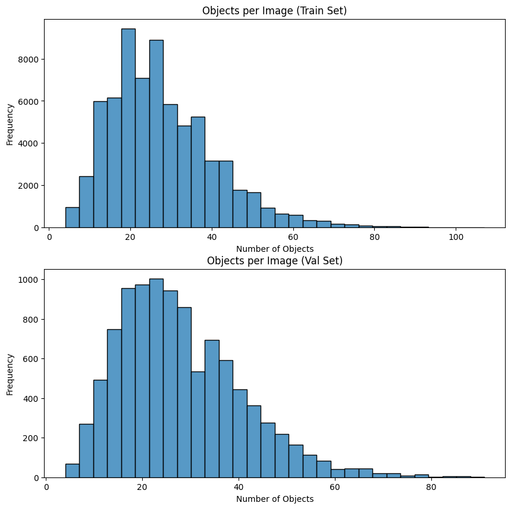
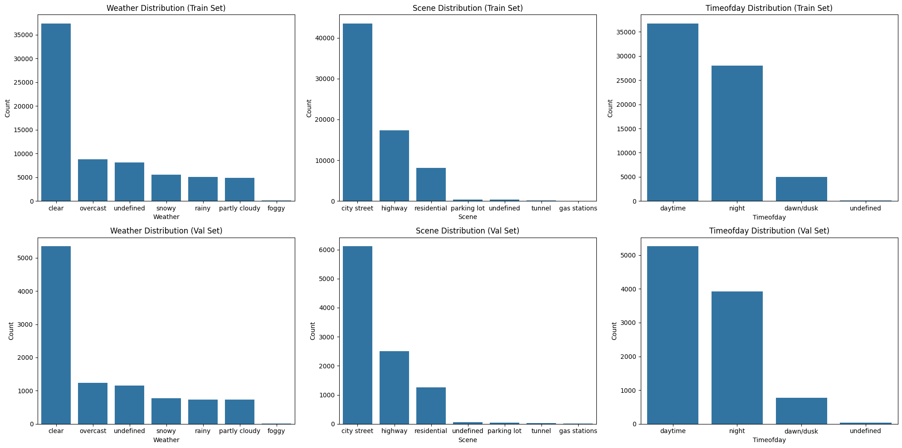
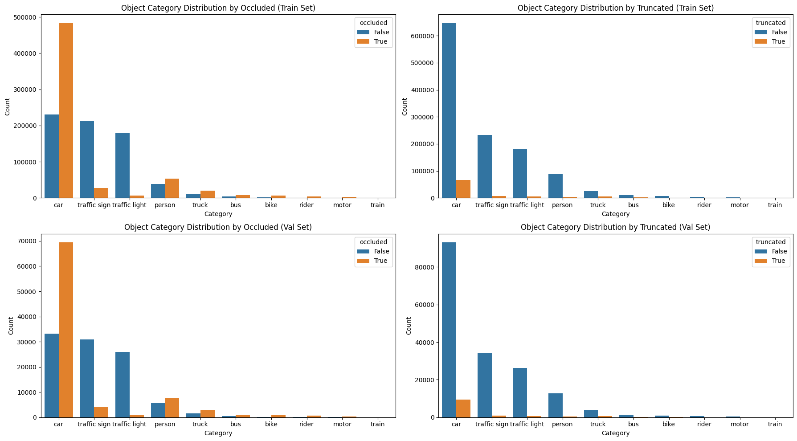

# Bosch Assignment - Nikhil Singh
## Data Analysis
### Observations
- Data Imbalance: There is a significant data imbalance across many parameters in the training and validation data.
    
    - Day and night time data is more prominent than dawn/dusk.
    - Clear skies overshadow other types of weather variations with foggy being close to non-existent.
    - City street, highway and residential have reasonable data-points while other classes are present in marginal numbers.
    - Classes have a significant data imbalance with classes like cars, traffic signs, traffic lights, and person having relatively more instances than other classes. 
    
    - Occluded cars are almost double in number than not occluded, this is because of the cars that are present further away in the lane and hence occluded by the car or any other vehicle present between the observer and that car.
    
- Image Quality in the dataset: The images in the dataset sometimes suffer from glare coming from the sun or headlights of other vehicles coming from the front. This results in a loss in information for the model and may result in missed predictions.
- Bounding box sizes: The bounding box sizes vary across the classes, for example -
    - A car present immediately ahead of the recording vehicle will have a bounding box that almost covers the entire frame while one in the distance will only span across a few pixels.
    - For the above reason, people, cars and vehicles in general have a higher variation in the sizes of the bounding boxes.
    - Traffic lights and signs have relatively smaller sizes as compared to the frame size.
## Training
### Model Choice
I’ve used YOLOv11m for this task because of my previous experience with YOLO and the Ultralytics library, which makes it easy for fast prototyping. The task here is object detection for possible use in some sort of driver assistance, in which case, latency will play a huge role. YOLO family of detection models have always been the most obvious choice in low latency use cases. 

**Experimentation**
Three iterations of the model were trained for the task. Default values for training and augmentations from ultralytics were chosen for experiments.
- Entire dataset, including the occluded images and truncated images.
- Entire dataset, excluding the occluded and truncated images. (The assumption here is that, any object that is occluded is behind something else and our priority in a driver assistance system would be to focus on the nearmost object. In case of truncated objects, the idea is that they’re partially out of frame, which in most cases indicate that they’re out of the path of the vehicle.)
- Class agnostic training, model detects objects from the background. This experiment also does not include occluded and truncated objects.

**All the model related files can be accessed in the "runs" folder under names of each of the above listed experiments. Also including the training curves and model evaluation curves.**

**Other Possible Experiments**
Few other possible experimentations that were not done due to limited time but could lead to better performance in detection on this kind of dataset.
Training different models for objects of different sizes i.e. traffic signs,  lights, etc are detected by one model, another model for vehicles and another one for rider, bike, person, etc.
Splitting the dataset for static and moving items in the frame and training separate models for each. Fixed items such as traffic signs, light, road markings are handled by one model while another one for vehicles and pedestrians.
## Evaluation
### Quantitative Method
For quantifying the model performance, we can take the mAP on the validation set along with a confusion matrix for all the classes. This can be used to compare various models and approaches. The **model_evaluation.ipynb** provides detailed comparison across these metrics of each model as well as the code to perform all the analysis based on different categories in the datast.
Following is a table showing the mean average precision of the models on validation dataset in two conditions, one when including occluded and truncated instances and second without it.
|Model/Val Type | Occluded and Truncated Included | Occluded and Truncated not Included |
|----|------|-----|
|Baseline (occluded instance in training)| 0.7467| 0.5534|
|Model without Occluded Instances | 0.6017 | 0.7178|
|Class agnostic model | 0.6628 | 0.7921 |

**Conclusions from the scores table**
First model performs well on data that has occluded and truncated instances but not as good on the data without the occluded and truncated instances. Other two models outperform the first model in that aspect. This can be mainly attributed to the differences in the training datasets of the models, with the first model being trained on the occluded and truncated instances while the other two are not.
Another thing to note here is that, model performance increases when model is made class agnostic as can be seen from the comparison of the second and the third model. 
A better approach in this case can be reducing the overall number of classes by merging of the similar classes like - vehicles, people, and traffic light and signs.

Confusion matrices for more granular comparison of the models under the occlusion and truncation conditions can be found in the **Assets/Files** folder. Please consider going thorugh the same.

### Qualitative Method
Evaluating the model performance qualitatively is tricky. Any general patterns in the model predictions, such as missing particular types of vehicles or in particular scenarios can be helpful to work and improve the model performance in that particular cohort. For example, if the model performance detoriates in the night, which can be attributed to the fact that low light images contain way lesser information than the images that are taken during the day. In order to mitigate this issue, multiple approaches can be tried based on the requirements and constraints. Adding another modality (LIDAR or Infrared) for more information for the model or defining the model limitations for that particular cohort can be possible solutions in such cases.

